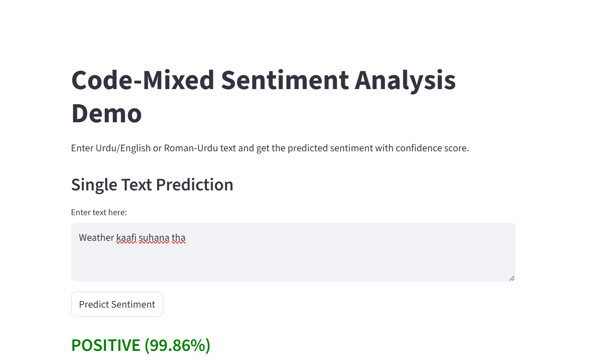
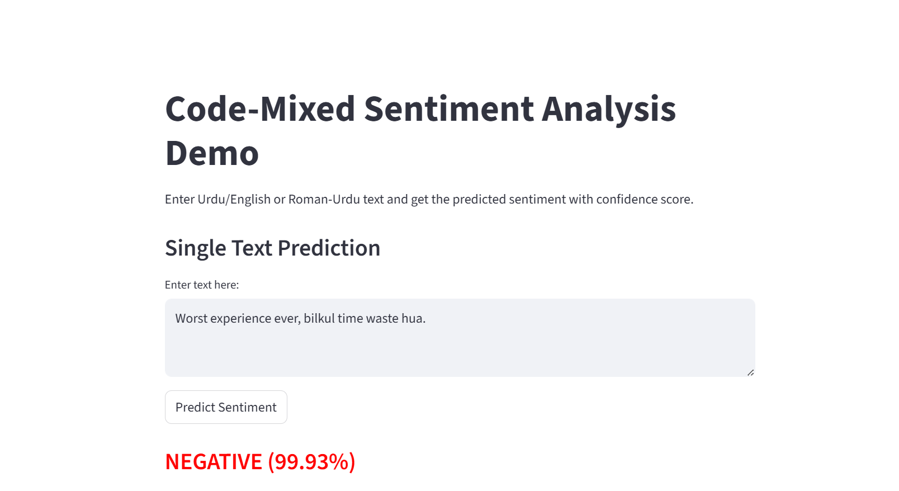
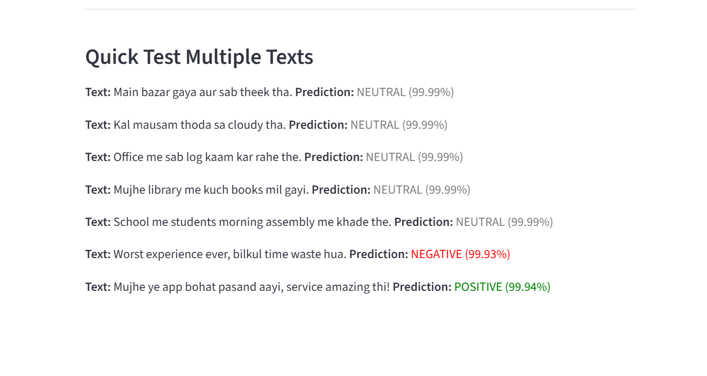
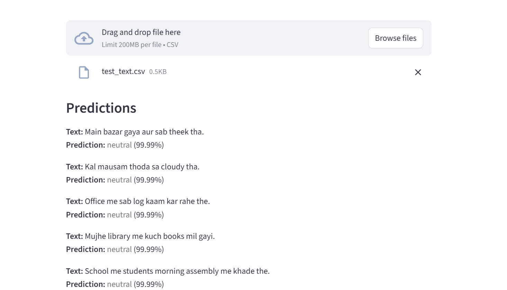
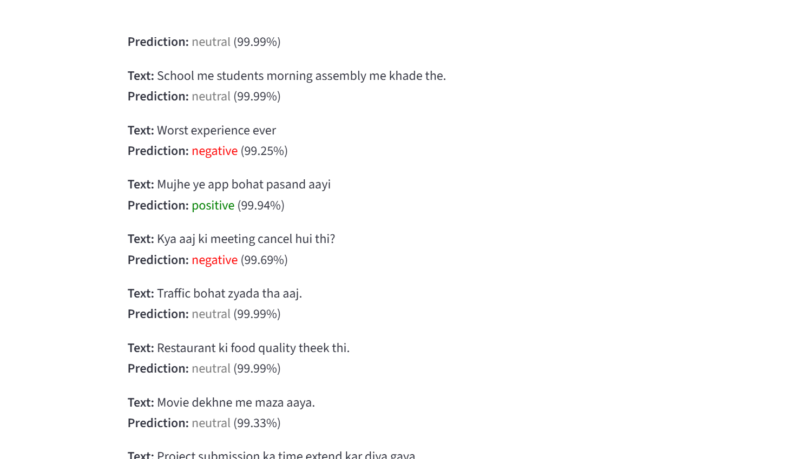

# Multilingual Code-Mixed Sentiment Analysis

This project focuses on **sentiment analysis for code-mixed text**, specifically Roman-Urdu and English mixed sentences. The goal is to build a **robust NLP model** capable of understanding sentiment in multilingual and code-mixed contexts, a common challenge in social media, reviews, and chat applications.

---

## 📝 Project Overview

Code-mixed text is challenging for NLP due to the mixture of languages, informal grammar, spelling variations, and transliterations. This project addresses these challenges by:

- Collecting and preprocessing real-world datasets in Roman-Urdu and English.
- Generating synthetic data to balance sentiment classes.
- Fine-tuning a multilingual transformer model (**XLM-RoBERTa**) for 3-class sentiment classification (Positive, Negative, Neutral).
- Providing a working demo for predictions via **Streamlit**.

---

## 📂 Dataset

We used two sources:

1. **RUSAD Dataset** – Roman-Urdu sentiment dataset with positive and negative labels.  
2. **Generated Dataset** – Synthetic Roman-Urdu/English code-mixed data including positive, negative, and neutral labels.

**Combined Dataset Statistics:**

| Label    | Count  |
|----------|--------|
| Positive | 6527   |
| Negative | 6112   |
| Neutral  | 858    |

**Data Splits:**

| Split       | Samples | Positive | Negative | Neutral |
|------------|---------|---------|---------|---------|
| Train      | 10797   | 5221    | 4889    | 687     |
| Validation | 1350    | 653     | 611     | 86      |
| Test       | 1350    | 653     | 612     | 85      |

---

## ⚙️ Model

- **Base Model:** `xlm-roberta-base`  
- **Fine-tuning:** Sequence classification for 3 sentiment classes  
- **Frameworks:** PyTorch, Hugging Face Transformers  
- **Performance:**  
  - Validation Accuracy: ~85%  
  - F1-score: ~85%  
- Handles **code-mixed text** effectively, predicting positive, negative, and neutral sentiments.

---
## 🖼 Screenshots

### Positive Prediction


### Negative Prediction 


### Multiple Prediction 


### CSV Prediction 


### CSV Prediction 



## 🛠 Installation

1. Clone the repository:

```bash
git clone <your-repo-url>
cd multilingual-llm-codemixed
```

2. Create a virtual environment and install dependencies:

```bash
python -m venv .venv
source .venv/bin/activate  # Linux/Mac
.venv\Scripts\activate     # Windows

pip install -r requirements.txt
```

3. Download the trained model and place it in the `models/xlm_roberta_sentiment_model` folder.

---

## 🚀 Usage

### Streamlit Demo

Run the demo to test the model on custom text inputs:

```bash
streamlit run demos/app.py
```

- Enter text in the textbox.
- Click **Predict Sentiment**.
- Model outputs Positive / Negative / Neutral.

### Direct Testing in Python

```python
from transformers import AutoTokenizer, AutoModelForSequenceClassification
import torch

model_path = "models/xlm_roberta_sentiment_model"

tokenizer = AutoTokenizer.from_pretrained(model_path, local_files_only=True)
model = AutoModelForSequenceClassification.from_pretrained(model_path, local_files_only=True)
model.eval()

def predict_sentiment(text):
    encoding = tokenizer(text, padding='max_length', truncation=True, max_length=128, return_tensors='pt')
    with torch.no_grad():
        logits = model(**encoding).logits
        pred_label_id = torch.argmax(logits, dim=-1).item()
    id2label = {0: 'positive', 1: 'negative', 2: 'neutral'}
    return id2label[pred_label_id]

# Test
print(predict_sentiment("Main bazar gaya aur sab theek tha."))
```

---

## 🧪 Evaluation

- Tested on unseen code-mixed text, achieving realistic predictions.
- Works with both Roman-Urdu and English code-mixed sentences.
- Correctly predicts neutral sentences like:
  - "Main bazar gaya aur sab theek tha."
  - "Office me sab log kaam kar rahe the."

---

## 💡 Key Achievements

- Built a robust sentiment analysis model for code-mixed text.
- Handled real-world challenges like Roman-Urdu transliterations and class imbalance.
- Created a working Streamlit demo for interactive testing.
- Achieved 85% validation accuracy, demonstrating practical effectiveness.

---
📄 For a detailed technical and research report, please see or download the pdf. [Project Report (PDF)](Project_Report_Kashif_Ali.pdf).

## 📁 Project Structure

```
multilingual-llm-codemixed/
├─ demos/
│  └─ app.py                # Streamlit demo
├─ models/
│  └─ xlm_roberta_sentiment_model/  # Fine-tuned model files
├─ data/                    # Optional: raw and processed datasets
├─ README.md
├─ requirements.txt
```

---

## 📖 Future Work

- Fine-tune on larger, more diverse code-mixed datasets.
- Integrate real-time social media streaming for sentiment detection.
- Extend to multi-class sentiment scales beyond positive/negative/neutral.
- Deploy as a web application with interactive dashboards.

---

## 🔗 References

- Hugging Face Transformers
- XLM-RoBERTa Paper
- RUSAD Dataset

**Author:** Kashif Ali  
